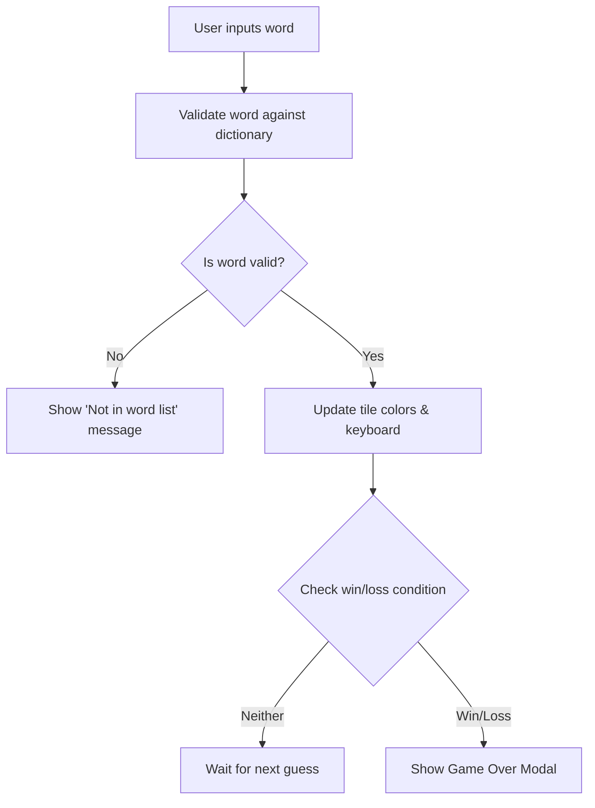

## 1. Product Overview
A fully working Wordle clone website with multiple game modes.
- Main purposes: Provide an engaging word puzzle game with both classic and challenging "insanity" modes.
- Target users: Word game enthusiasts looking for a clean, ad-free Wordle experience with a comprehensive dictionary (excluding names and bad words).

## 2. Core Features

### 2.1 Game Modes
| Mode | Features |
|------|----------|
| Classic | Standard 5-letter Wordle with 6 guesses. |
| Insanity | 6-letter words, 5 guesses, strict validation (must use discovered hints), and a countdown timer. |

### 2.2 Feature Module
1. **Game Board**: The grid where letters are entered.
2. **On-Screen Keyboard**: Interactive keyboard showing letter states (correct, present, absent).
3. **Settings/Mode Selector**: Switch between Classic and Insanity modes.
4. **Statistics/Game Over**: Modal showing win/loss, the correct answer, and a play again button.

### 2.3 Page Details
| Page Name | Module Name | Feature description |
|-----------|-------------|---------------------|
| Main Game | Game Board | 5x6 or 6x5 grid of letter tiles with 3D flip animations. |
| Main Game | Keyboard | QWERTY layout updating colors based on guesses. |
| Main Game | Header | Title, mode toggle, and stats button. |

## 3. Core Process
1. User opens the app.
2. Selects a mode (Classic/Insanity).
3. Enters a word guess.
4. Game validates the word against the dictionary (which excludes names and bad words).
5. Board and keyboard update with color hints.
6. If the word is correct or the user is out of guesses, the Game Over modal is shown.

## 4. User Interface Design
### 4.1 Design Style
- Primary and secondary colors: Dark mode by default. Vibrant Emerald Green for correct, Electric Yellow for present, and Deep Slate for absent.
- Typography: Distinctive, bold display font for tiles (e.g., 'Syne' or 'Outfit'), paired with a readable sans-serif for UI elements.
- Button style: Rounded corners, slight scale effect on active/tap.
- Layout style: Centered column, mobile-friendly flexbox with subtle background noise texture.

### 4.2 Page Design Overview
| Page Name | Module Name | UI Elements |
|-----------|-------------|-------------|
| Main Game | Header | Sticky top, sleek mode toggle switch, icon buttons. |
| Main Game | Grid | CSS Grid, 3D flip animations for tiles, shake animation for invalid words. |

### 4.3 Responsiveness
Desktop-first, fully mobile-adaptive. The keyboard and grid scale down on smaller screens.
