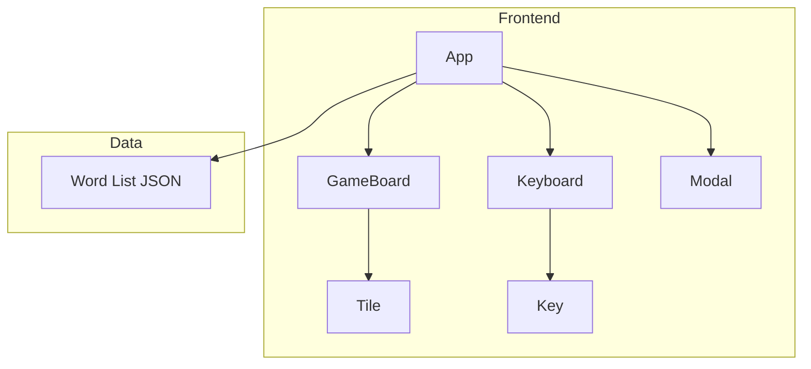

## 1. Architecture Design

## 2. Technology Description
- Frontend: React@18 + tailwindcss@3 + vite
- Initialization Tool: vite
- Language: TypeScript
- Icons: lucide-react
- Word Dictionary Source: A curated 5-letter and 6-letter JSON array. We will filter out any names and bad words programmatically if necessary or pre-generate a clean list.

## 3. Route Definitions
| Route | Purpose |
|-------|---------|
| / | Main game interface with both Classic and Insanity modes |

## 4. API Definitions
N/A (Frontend-only application). The word list will be loaded as static JSON files.

## 5. Server Architecture Diagram
N/A

## 6. Data Model
### 6.1 State Management
- `gameMode`: 'classic' | 'insanity'
- `guesses`: Array of strings (e.g., `['APPLE', 'PEACH']`)
- `currentGuess`: String
- `gameStatus`: 'playing' | 'won' | 'lost'
- `solution`: String

### 6.2 Letter States
- `correct`: Green
- `present`: Yellow
- `absent`: Gray
- `empty`: Blank tile
